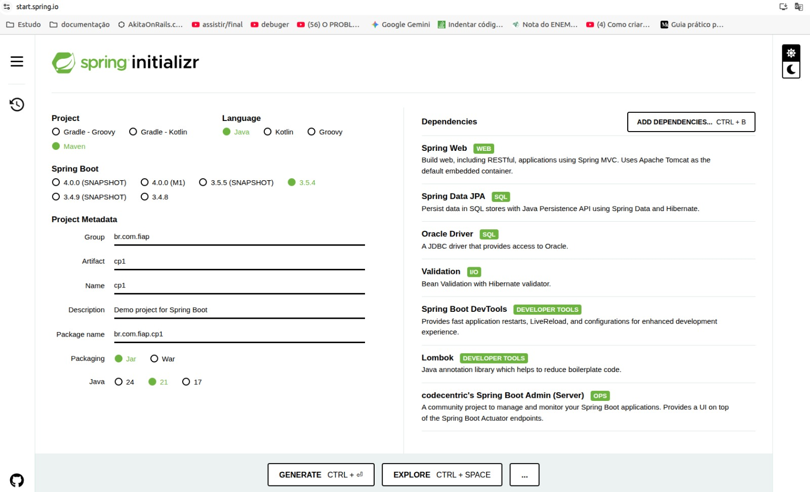
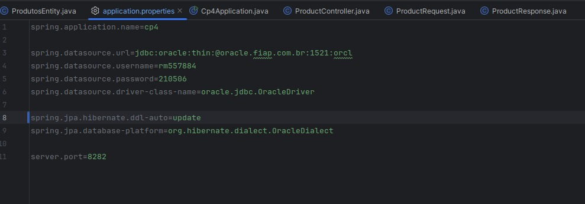
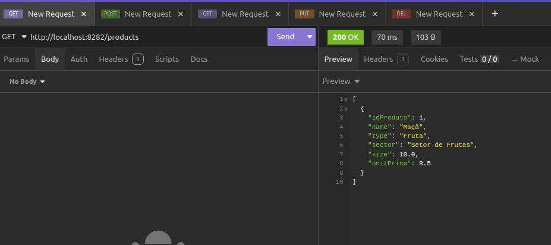
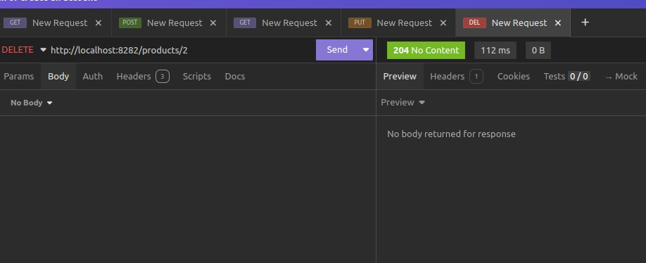
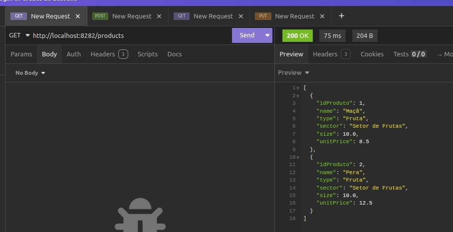
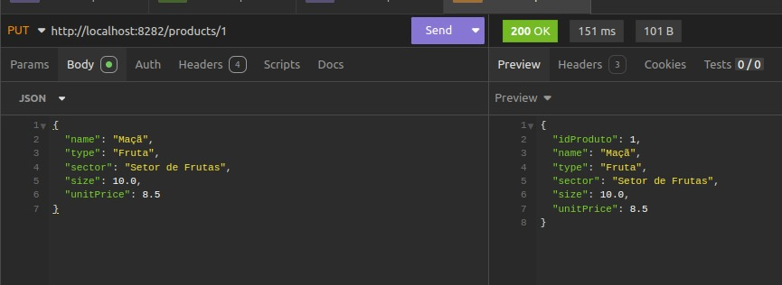
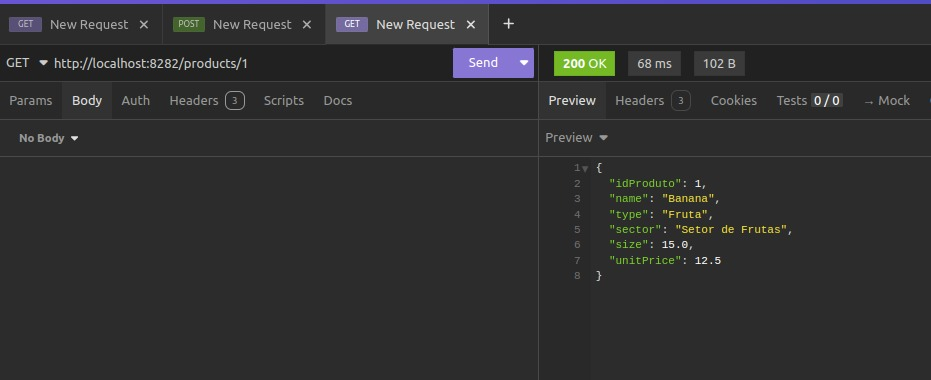
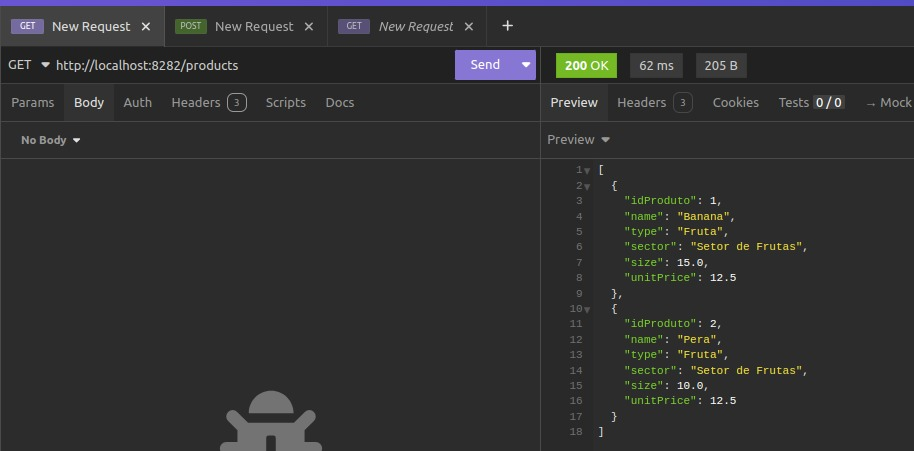
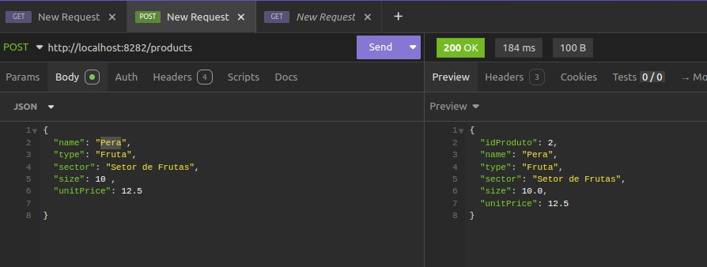
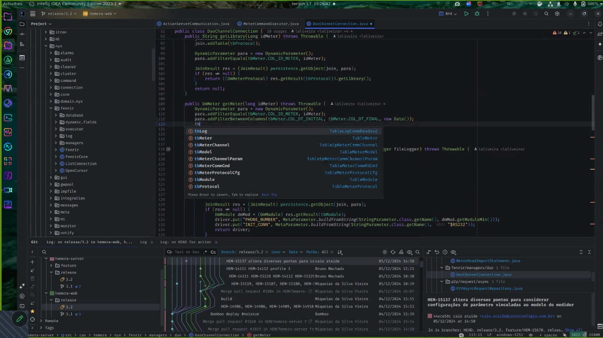

## CP4 – API de Produtos (Spring Boot)

Aplicação REST para cadastro de produtos, construída em Java com Spring Boot e persistência em Oracle Database. O projeto expõe um CRUD completo para a entidade `Produtos` e está documentado com OpenAPI/Swagger.

### IDE utilizada
IntelliJ IDEA Community Edition.



### Configuração do Spring Initializr
Projeto gerado com as seguintes opções:
- Linguagem: Java
- Build: Maven
- Spring Boot: 3.5.4
- Dependências: Spring Web, Spring Data JPA, Validation, Spring Boot DevTools, Lombok, Oracle Driver, Springdoc OpenAPI



---

### Tecnologias e dependências principais
- Spring Boot Starter Web
- Spring Boot Starter Data JPA
- Spring Boot Starter Validation (Jakarta Bean Validation)
- Hibernate ORM
- Oracle JDBC (ojdbc11)
- Lombok
- Springdoc OpenAPI UI (Swagger UI)

---

### Modelagem
Entidade `Produtos` com os campos:
- `idProduto` (Long)
- `name` (String)
- `type` (String)
- `sector` (String)
- `size` (double)
- `unitPrice` (double)

DTOs:
- `ProductRequest`: `name`, `type`, `sector`, `size`, `unitPrice`
- `ProductResponse`: `idProduto`, `name`, `type`, `sector`, `size`, `unitPrice`

---

### Endpoints (CRUD)
Base URL: `http://localhost:8282`
Recurso: `/products`

- GET `/products` – Lista todos os produtos
- GET `/products/{idProduct}` – Busca por ID
- POST `/products` – Cria um novo produto
- PUT `/products/{idProduct}` – Atualiza um produto existente
- DELETE `/products/{idProduct}` – Remove um produto

Status codes observados:
- 200 OK para buscas, criação e atualização
- 204 No Content para exclusão
- 404 Not Found quando o recurso não existe

#### Exemplos

Listar todos:
```bash
curl -X GET http://localhost:8282/products
```

Buscar por ID:
```bash
curl -X GET http://localhost:8282/products/1
```

Criar:
```bash
curl -X POST http://localhost:8282/products \
  -H "Content-Type: application/json" \
  -d '{
    "name": "Banana",
    "type": "Fruta",
    "sector": "Setor de Frutas",
    "size": 15.0,
    "unitPrice": 12.5
  }'
```

Resposta (exemplo):
```json
{
  "idProduto": 1,
  "name": "Banana",
  "type": "Fruta",
  "sector": "Setor de Frutas",
  "size": 15.0,
  "unitPrice": 12.5
}
```

Atualizar:
```bash
curl -X PUT http://localhost:8282/products/1 \
  -H "Content-Type: application/json" \
  -d '{
    "name": "Maçã",
    "type": "Fruta",
    "sector": "Setor de Frutas",
    "size": 10.0,
    "unitPrice": 8.5
  }'
```

Excluir:
```bash
curl -X DELETE http://localhost:8282/products/1
```

Alguns prints das requisições durante os testes:










---

### Documentação OpenAPI/Swagger
Após subir a aplicação, acesse:
- Swagger UI: `http://localhost:8282/swagger-ui/index.html`
- OpenAPI JSON: `http://localhost:8282/v3/api-docs`

---

### Configuração de ambiente
Arquivo `cp4-java/src/main/resources/application.properties`:

```properties
spring.datasource.url=jdbc:oracle:thin:@oracle.fiap.com.br:1521:orcl
spring.datasource.username=<usuario>
spring.datasource.password=<senha>
spring.datasource.driver-class-name=oracle.jdbc.OracleDriver
spring.jpa.hibernate.ddl-auto=create
spring.jpa.database-platform=org.hibernate.dialect.OracleDialect
server.port=8282
```

Recomenda-se exportar usuário e senha por variáveis de ambiente ou arquivo `.env` próprio para o seu ambiente.

Pré-requisitos:
- Java 21
- Maven 3.9+
- Banco Oracle acessível e credenciais válidas

---

### Como executar
No diretório raiz do projeto:

```bash
mvn -f cp4-java/pom.xml spring-boot:run
```

Ou gerando o jar:

```bash
mvn -f cp4-java/pom.xml clean package
java -jar cp4-java/target/*.jar
```

---

### Estrutura de pastas

```
cp4-java/
  README.md
  docs/
    images/
      intellij.jpeg
      spring-initializr.jpeg
      api-1.jpeg ... api-8.jpeg
  cp4-java/
    pom.xml
    src/
      main/
        java/br/com/fiap/cp1/
          controller/
          dto/
          entity/
          repository/
          service/
        resources/application.properties
      test/
```

Ao enviar o trabalho, incluir toda a pasta do projeto com todas as subpastas e arquivos.

---

### Licença
Projeto acadêmico para fins educacionais.


